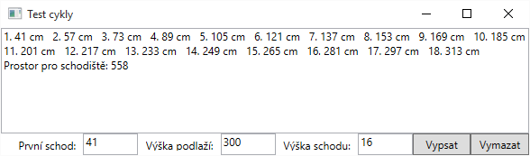
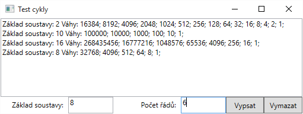

# Domácí úkol Schodiště (Stairs)
Vytvořte aplikaci, která urychlí funkční návrh schodiště v novostavbě.

## Funkční požadavky:
* Vstupem jsou celá kladná čísla (v centimetrech)
* Výška prvního schodu se zadává odděleně (v novostavbě je první schod vyšší o skladbu podlahy – izolace, systémová deska, cementová mazanina)
* Výška podlaží je minimální překonávaná výška (typicky od základové desky po horní hranu krovu prvního patra)
* Výstup zobrazí předpokládané výškové hladiny jednotlivých schodů a jejich počet (ve tvaru pořadové číslo schodu, mezera, výška v centimetrech, mezera a jednotka)
* Nakonec bude spočítána a zobrazena hodnota horizontálního rozměru schodiště (v cm). Jedná se o součin počtu schodů a hloubky schodnice.

**Optimální hloubka schodnice** je spočítána z tzv. *kročejové vzdálenosti*, kdy platí: `2 × výška schodu + 1 × hloubka schodnice = 63 cm`

## Nefunkční požadavky:
* K realizaci použijte cyklus `do-while` (nebo `while`)
* Vyhýbejte se použití duplicitního kódu (tzn. žádné dva „řádky“ programu by neměli být stejné nebo téměř stejné)
* Při výpočtu výškových hladin schodů smíte použít pouze operaci **sčítání**
* Výstup vypisujte až po ukončení vkládacího cyklu a data ukládejte do „mezipaměti“ ve třídě `Stair`

# Domácí úkol Váhy (Orders)
Vytvořte aplikaci, která usnadní líným *ajťákům* vypočítávání vah jednotlivých řádů libovolné číselné soustavy.

## Funkční požadavky:
* Vstupem je malé kladné celé číslo (základ soustavy a počet vypisovaných řádů)
* Výpis zobrazí základ soustavy a sestupně seřazený seznam vah

## Nefunkční požadavky:
* k realizaci použijte cyklus for
* při výpočtu jednotlivých vah smíte použít pouze operaci **násobení** (tedy ne mocninu `Math.Pow()`)
* výstup vypisujte až po ukončení cyklu, ne během každé iterace.
* řešte objektovou dekompozicí
